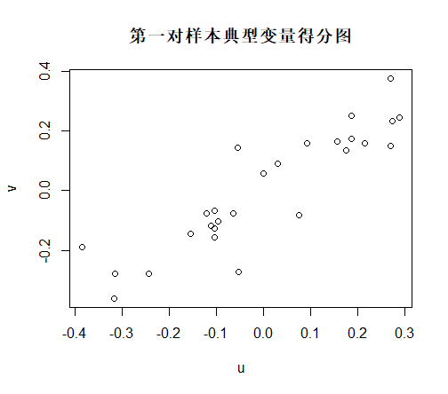
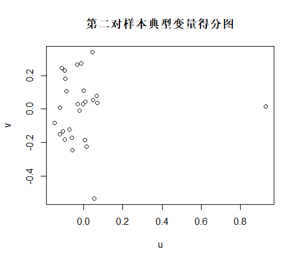
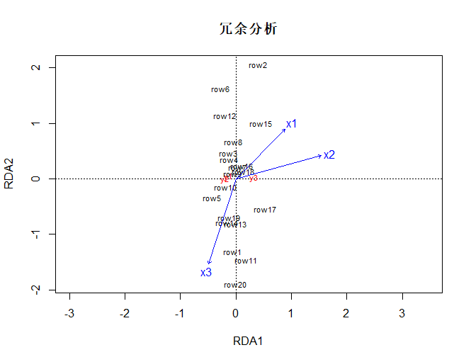

# 第十章 典型相关分析

canonical correlation analysis

* 教材10.2节: 例10.2.1 矿区下部矿的典型相关分析
* 教材10.3节: 例10.3.1 康复俱乐部成员测试的冗余分析

文件夹内容说明:

* *.RData文件为运行结果;
* img文件为结果图;
* cca.R 实现典型相关分析
* corcoef.test.R 是网上搜到的假设检验函数
* table10.1 矿区下部矿数据
* table10.2 康复俱乐部成员测试数据

## 绘图结果：
* 得分图:
  
  

  

* 冗余分析：
  
  