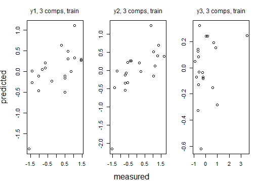

# 第十一章 偏最小二乘回归分析

教材11.2节 例11.2.1 康复俱乐部成员测试偏最小二乘回归分析

** 建议参考: https://www.cnblogs.com/payton/p/5253035.html **

文件夹内容说明:

* *.RData文件为运行结果;
* img文件为结果图;
* pls.R 实现偏最小二乘回归分析
* table11.1 康复俱乐部成员测试数据

## 绘图结果：
* pls:
  
  
