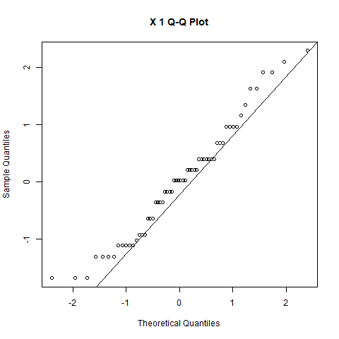
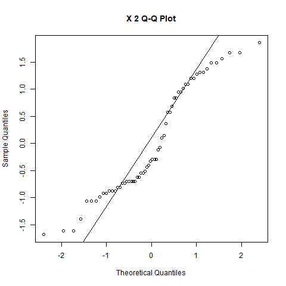
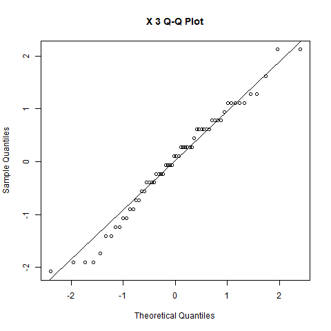
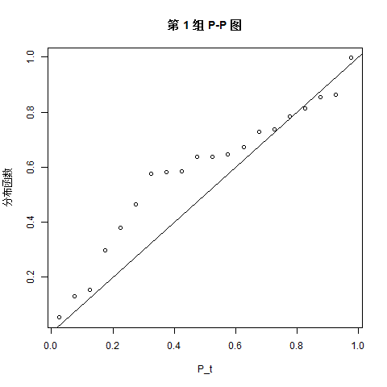
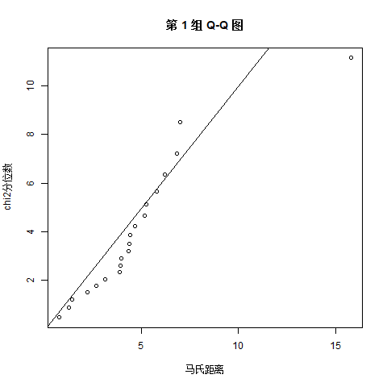
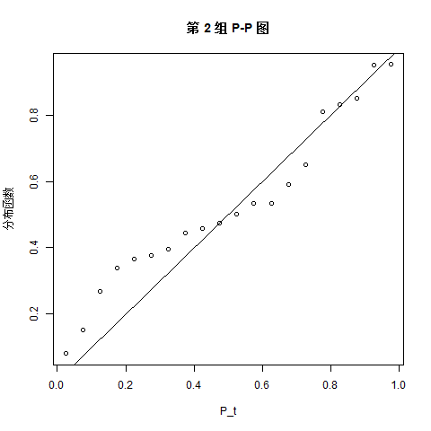
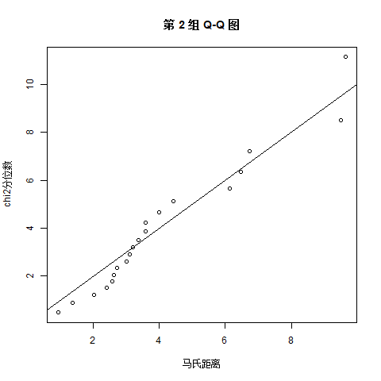
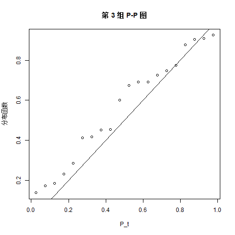
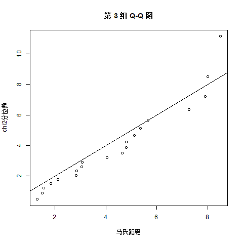

# 第三章 多元正态总体参数的假设检验

教材3.3节 多总体均值向量的检验 例3.3.2实现 及 习题3-13.

文件夹内容说明:

* img文件为结果图
* table3.3为教材中表3.3 身体指标化数据
* .RData文件为运行结果
* .R文件包括以下内容:
    * 多总体均值向量的检验(多元方差分析manova)
    * 一元数据正态性检验的多种方法
    * 多元数据正态性检验的卡方图检验法(P-P plot & Q-Q plot)

## 绘图结果：
判断每个分量是否是一元正态:

卡方图检验法:

