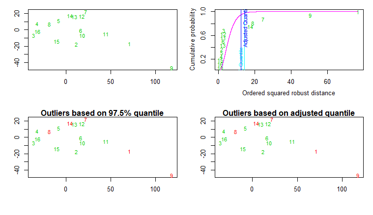
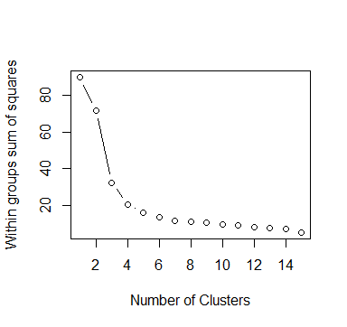
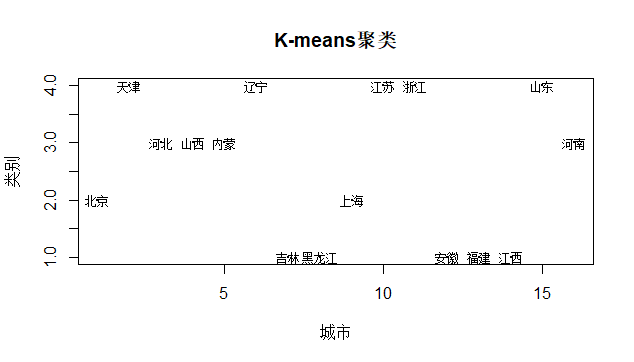
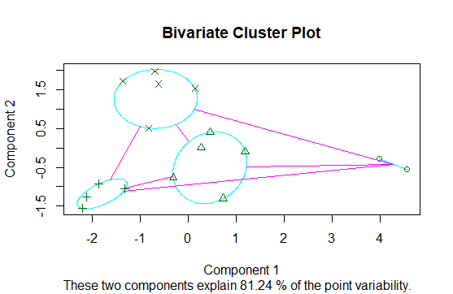
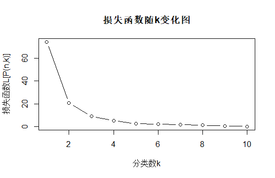

# 第六章 聚类分析

教材6.4节 系统聚类法的性质及类的确定 例6.4.1实现 
教材6.5节 动态聚类法(K-means) 例6.5.3实现
教材6.6节 有序样品聚类(最优分割法) 例6.6.1实现

文件夹内容说明:

* .RData文件为运行结果;
* img文件为结果图;
* table6.7为教材p243例6.4.1：16个地区农民生活水平的调查数;
* hierarchical agglomerative clustering.R实现了系统聚类;
* kmeans pam.R实现K-means聚类和围绕中心点的划分聚类;
* ocluster.R为最优分割法实现函数
* ordered clustering.R实现有序样品聚类(最优分割法)
* todo: 变量聚类

## 绘图结果：
* 系统聚类部分结果, 其余图片在img中

* k-means & pam

* 有序聚类
  

