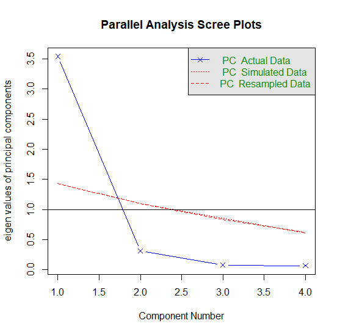
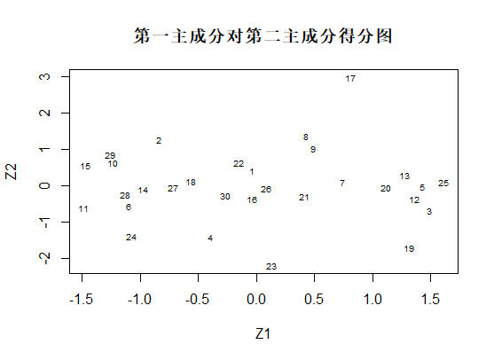
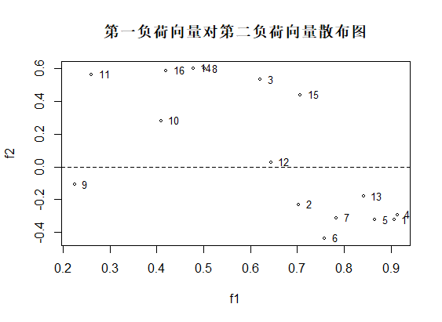

# 第七章 主成分分析

教材7.2节 中学生身体四项指标的主成分分析 例7.2.1实现 

教材7.3节 16项身体指标数据分析 指标分类 例7.3.1实现

教材7.3节 经济分析主成分回归 例7.3.3实现

文件夹内容说明:

* *.RData文件为运行结果;
* img文件为结果图;
* pca.R 实现主成分分析 指标分类 主成分回归
* table7.4 中学生身体四项指标
* table7.5 16项身体指标数据分析
* table7.6 经济分析数据

## 绘图结果：
* pca碎石检验
  
  

* p279得分图
  
  

* pca结果
  
  

* p284散布图
  
